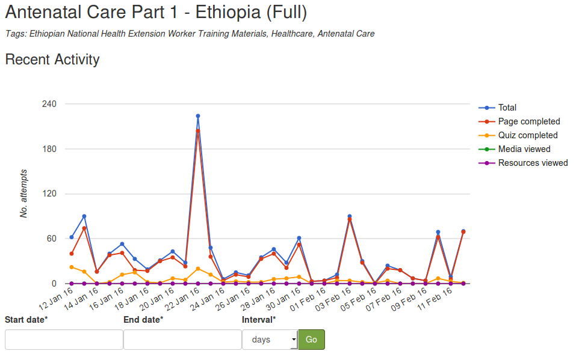
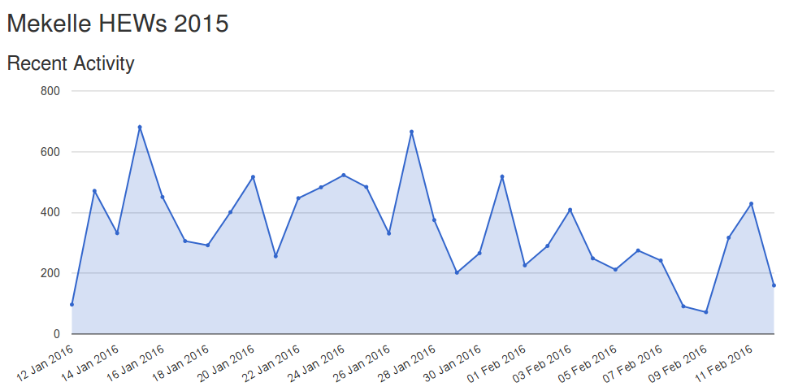
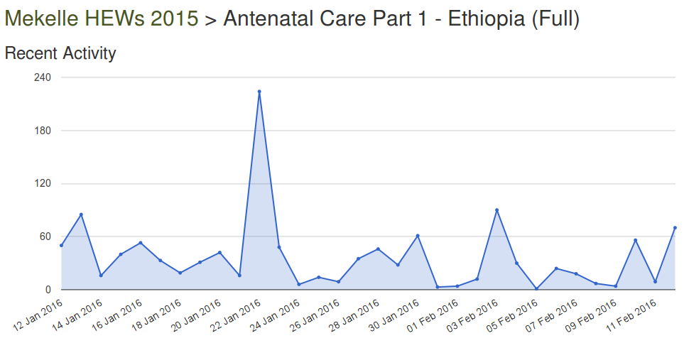

Activity and Progress Monitoring
====================================

View recent daily activity on server
------------------------------------

The server dashboard homepage shows a graph of the daily activity for the last month:

.. image:: images/activity-all.png

View daily/monthly activity on server between specific dates
-------------------------------------------------------------

Under the daily activity graph on the server homepage, you can select a date range and interval (days or months) to update the graph:

.. image:: images/activity-all-daterange.png

.. note::
	If you select the interval as 'days' and a long date range, it may take a long time to generate the graph - especially if there has been a lot of activity on the server.

View server summary activity
---------------------------------

#. From the menu bar, select 'Analytics' > 'Summary Overview'
#. You will see a series of graphs and charts for the data from the last year (grouped by month), such as:

	* monthly activity
	* user registrations, both monthly and cumulative
	* activity by country and language
	* course downloads, both monthly and cumulative
	* most active courses, in the last month
	

View activity for specific course
-------------------------------------

#. From the menu bar, select 'Courses'
#. Browse to the course and click on its title
#. You will see the daily activity for the last month, and the option to select a date range and interval to view by.

View activity for specific cohort (group)
-------------------------------------------

#. From the menu bar, select 'Cohorts'
#. Browse to the relevant cohort. 
#. You can either select to view the activity for the whole cohort (click on the cohort title), or you can view the activity for a specific course within a cohort (click on the course title)

View activity for specific user
--------------------------------

Wherever you see a users name, you can click on their name to go directly to view their activity.

.. image:: images/activity-user-all.png

View activity for specific user on a particular course
--------------------------------------------------------
 
From the user homepage, you can select which course to view the full detail from.

.. image:: images/activity-user-course.png