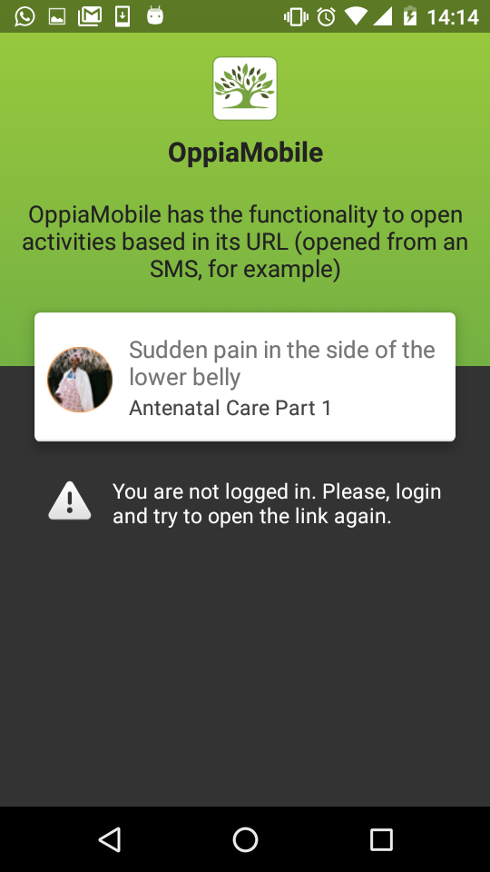

Launching OppiaMobile Activities from other Applications
==========================================================

.. note:: 
	This development is a work in progress, so not everything may be completed and tested well. We'd welcome any 
	feedback and suggestions on how we can improve on what has already been done. 
	
In order to allow other applications to launch specific activities in the OppiaMobile app, this can now be done by using 
a standard weblink. 

The main use-cases for this functionality are:

* data collection or other support tools needing to link directly to refresher information/activities
* being able to send via SMS, WhatsApp or similar a direct link to a specific activity

Using a link, rather than an Android intent, helps to direct the user to the activity online if the app is not installed.

The links used should be in the following format:

http://demo.oppia-mobile.org/view?digest=XXXXXXXXX

The digest is a unique identifier for the specific activity in OppiaMobile - these can be found in the module.xml of the 
course zip package.

Here is an example of a link appearing in a text message (of course this link could also be in other apps):

.. image:: images/launch-link.png

As the app is registered to open these kinds of links, when you clink on a URL like that, Android will prompt you for 
which app to open the link with. If you select the OppiaMobile app, it shows you a page informing you of the 
functionality, and allows you to continue to that concrete activity:
	
.. image:: images/app-open.png
	
From here, you can either open the activity or close this window. The tick in the bottom right indicates if the current 
logged in user has already completed this activity. If the user is not logged in right now, it will also show the info 
of the activity, but won't let you navigate to it:

​If the course that contains the activity is not installed in the device, the app won't find the activity by its digest, 
and it will show the message:

.. image:: images/activity-not-found.png

This is the main functionality developed so far, but we still have yet to develop the part when the user selects the 
browser as the app with which to open the link (or the OppiaMobile app is not installed) - and will then redirect to the 
activity on the web.