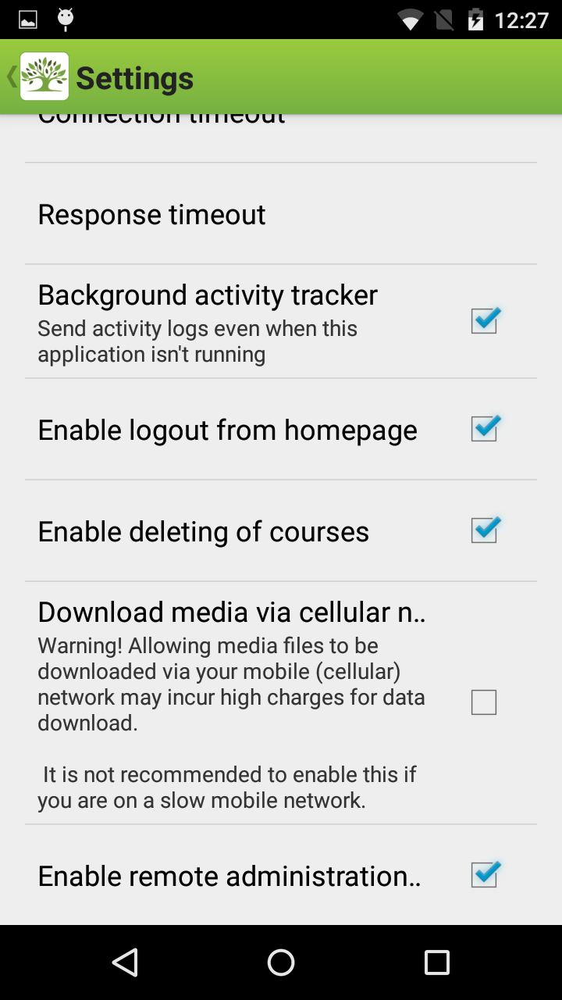
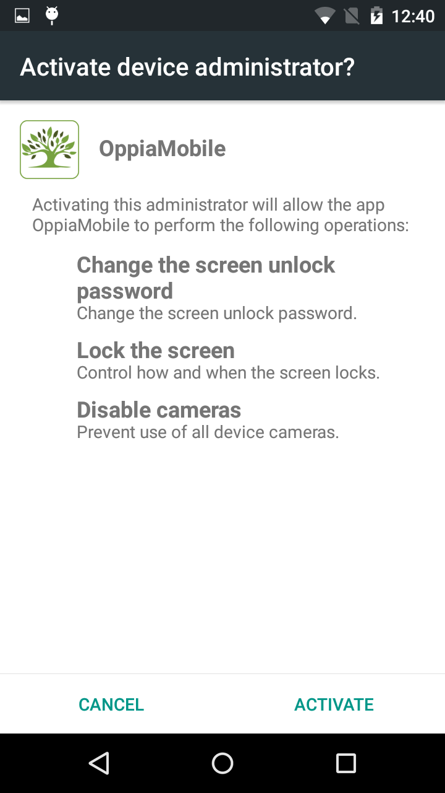
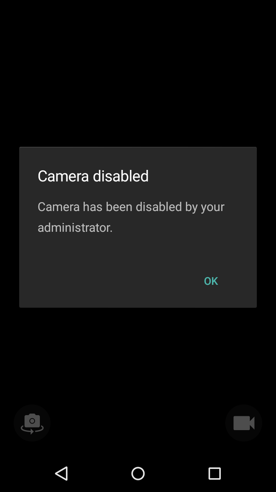
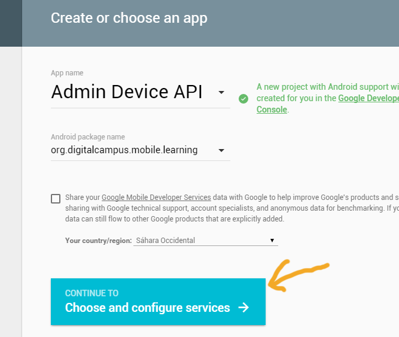
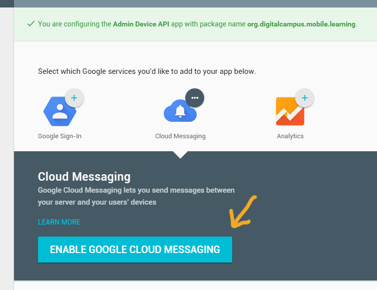
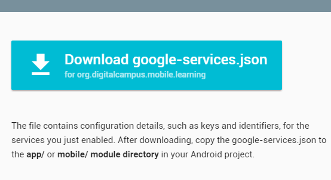

Remote Device Admin
======================

Introduction
-------------

This feature allows the administrator of an OppiaMobile instance to remotely manage some options of the devices which have the app installed. For example, it can be useful to manage the device losts, locking them or remotely wiping all the phone data, specially important in the case of health workers who may have data/photos stored on the device.

In the mobile part, it uses the Android `Device Administration API <http://developer.android.com/intl/es/guide/topics/admin/device-admin.html>`_ to access some device features at system level. The available features in this API include the possibility to manage security options of the device (screen lock system, user password, enforce password complexity), as well as enabling/disabling the device cameras or perfoming a data wipe, restoring the device to its factory defaults.

Currently, OppiaMobile supports the following options:

- Enable/disable device cameras
- Lock device and set a new password

Due to its severity, the Device Administration permissions cannot be automatically granted to an app, so they must be confirmed by the user. To activate the Romete Device Admin, there is an option available in the Settings activity:

Once the option is checked, a dialog appears prompting the user for the admin permissions, where he can see before activating the functionality which admin operations will the app be allowed to perform:

Once we have permissions, we can see OppiaMobile as an administrator app in the Settings-->Security section of the phone, where we can disable its features again (the app will noticed it and update its configuration). The remote device admin can be also disabled from the Settings activity of the app.

.. image:: images/device-admin3.png

Below you can see an image of how the camera app looks when you have disabled the device cameras from the remote administration:

Architecture
---------------

The communication needed by the system is not the usual where the client is the one that initiates the request, but the opposite, as is the server the one who has to start the request for a given transaction. This is implemented with a push messaging mechanism. 

This functionality is implemented using the Google Cloud Messaging platform, a free service by Google to send push messages to client apps through their GCM connection servers. The service handles all aspects of enqueuing of messages and delivery to the target application running on the target device.
The implementation includes the GCM Google connection server, the OppiaMobile server that interacts with the connection server via HTTP protocol, and the Android client app that receives the messages.

.. image:: images/gcm-architecture.png

1. First of all, to receive and send GCM messages the app must register with GCM and get a unique identifier called a registration token.

2. When a user registers in the app and enables the Remote admin functionality, we register the device (if it was not previously registered) in the Google Cloud Messaging server. Also, the device sends a message to the OppiaMobile server reporting that it has succesfully registered in the GCM servers, including in the request the senderID that identifies it.

3. Then, when we want to perform an action in a device from the server, we send a message to the GCM connection servers that includes the unique identifier of that device. The GCM connection server enqueues and stores the message if the device is offline, so it doesn't have to be online at that exact moment.

4. Once the device gets internet access, the GCM server sends the message to it, that receives it and proccesses the order accordingly.

Setting up (customization)
----------------------------

Compiling the app
^^^^^^^^^^^^^^^^^^
Since the app uses the latest version of the Google Cloud Messaging library, we could face some problems when trying to compile the project. For the mobile version, we need to check that we have the following libraries installed:

- We need the Google Services library installed (via SDK Manager), at least the ``1.4.0`` version
- We need to include in the project the library ``com.google.android.gms:play-services-gcm``, at least the ``8.1.0`` version.
- Android buildTools v21.1.2 or superior

In some cases, we can face a DexLoader error when building the project once we have solved all the dependencies. Android APKs contain executable bytecode files in the form of Dalvik Executable (DEX) files, which contain the compiled code used to run the app. The Dalvik Executable specification limits the total number of methods that can be referenced within a single DEX file to 65,536, including Android framework methods, library methods, and methods the app own code. The problem is probably related with the addition of the Google Play Services library, as it contains a huge amount of methods. To solve it, add only the GCM part of the Google Services SDK instead of the whole library, as it causes limit overhead in the Dalvik compile process. 

Registering the app in GCM
^^^^^^^^^^^^^^^^^^^^^^^^^^^
To use a custom OppiaMobile server, each project needs its own Google Cloud Messaging keys, both for the server and client (app) side.

To obtain an API key for the Google Cloud Messaging platform, you just need to create it from this link in the Google developers console: https://developers.google.com/mobile/add?platform=android&cntapi=gcm . You need to be logged in with a Google account, and just introduce the values in the form. For the app name, you can set whatever you want, and in the package, you must set the android package name (in the case of OppiaMobile, it is ``org.digitalcampus.mobile.learning``). 

In the next screen, select the Cloud Messaging option if it doesn't start selected, and press the "Choose and configure services" button.

Once you do that, you'll see your API keys for the project. The first one, the "Server API Key", is the one that goes in the server side.

.. image:: images/gcm-step3.png

After this, you can go to the next step and download the google-services.json file with all the configuration values. 

 
Setting up within the app
^^^^^^^^^^^^^^^^^^^^^^^^^^^

For the app, there are two possible options:
- If the project is configured with Android Studio and gradle, simply put the ``google-services.json`` at the ``app`` directory level. The plugin ``com.google.gms.google-services`` will take the values from the JSON and generate the needed resource values.
- If the project is configured to be built with the Eclipse ADT plugin, that resource has to be added manually. To do so, we need to add (or update the one present) the ``gcm_defaultSentderId`` string value (in ``res/values/strings.xml``) with the one in the JSON file.

Setting up the server side for managing
^^^^^^^^^^^^^^^^^^^^^^^^^^^^^^^^^^^^^^^^
//TO-DO