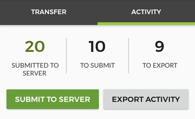
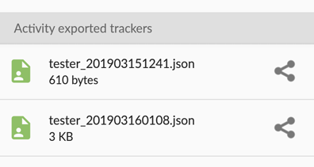
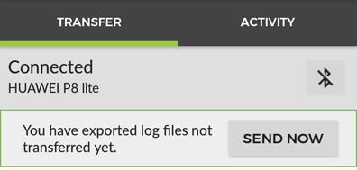
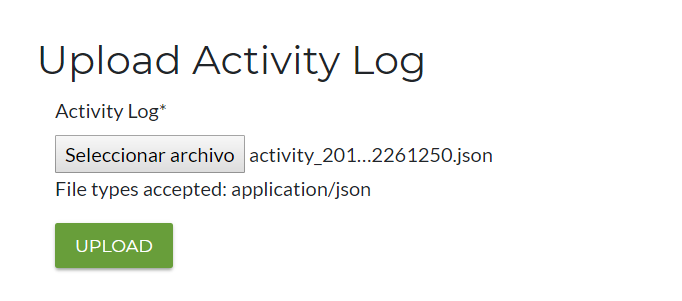

Downloading Activity Logs
===========================
	
During the normal functioning of the app in a setting where there is a chance that internet connection is available, the app sends
student activity trackers to the server automatically. But in a no-internet access environment, this data cannot be
uploaded to the server that way, so there is the need for a different mechanism to fulfill this need.

Basic Workflow
------------------

#. The user completes course activities, quizzes and media as normal, and her activity is tracked.
#. Under the ``Sync`` menu, the trackers are exported into an activity log file
#. A supervisor or project staff member transfers the exported activity logs onto their device via Bluetooth
#. When they are in an area with internet connection, the activity trackers are
   automatically sent to the server.
#. Alternatively, the staff member can download this activity log files and upload them manually in the server.

The Sync > Activity view
--------------------------

To access the Activity logs functionality, select the "Sync" option from the main menu.
This will get you to the Synchronize view, where there are two different tabs. There, you have to select the `Activity` tab.

In this view, you have a summary of the activity logged in the device:

* **To export**: Activity trackers registered in the device, that have not been exported nor submitted
* **To submit**: Activity trackers that have been exported in the device, but not sent to the server yet
* **Submitted**: Activity that is already registered in the server

The action to ``submit to server`` is used to manually trigger the tracker uploading (of both exported activity logs saved
in the device, and user activity pending to submit). This is also perform automatically by the app periodically.

The action to ``Export activity`` will fetch all the activity that is not yet exported nor submitted, and will create
an activity log file, in the form of a JSON file containing all the activity trackers and basic user information, and will
show the file (and any other remaining activity log file to transfer in the list below the actions.

Using the share icon that appears to the side of each log file will open the share dialog, prompting you to select an app
to share the file with. **Note that this will transfer the file out of the realm of the app, so the user will have to
upload it manually later**.

Sharing log activity files
---------------------------

Instead of using the share option, we can transfer the activity log files between devices using the app. This will keep
the file inside the app storage, making it possible to be automatically upload to the server once an internet connection
becomes available. For this, once two devices are connected via Bluetooth (see the "Bluetooth" section), if a device has
some activity log file pending to transfer, a message will appear below the status bar:

Pressing the `Send now` button will send the activity log files to the other device and remove them from the current one.

Manual upload
--------------
If the file was not transfer from within the app, the activity log file will be outside of the realm of action of the app,
and has to be manually uploaded to the server. To do so, the user has to log in the server, select the option to
upload an activity log, and attach the file to the Upload activity log form.

