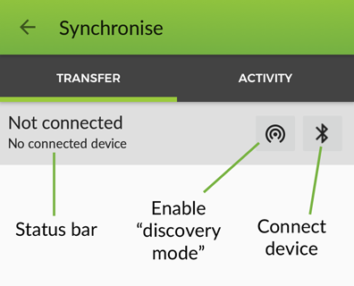
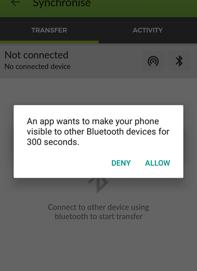
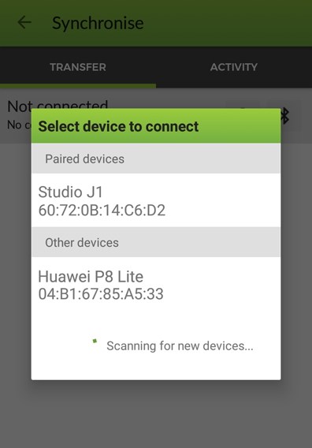
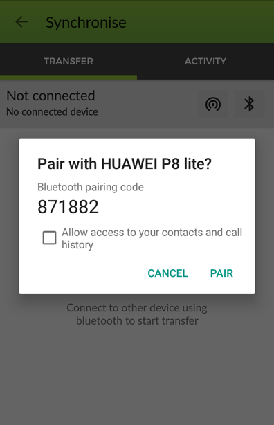
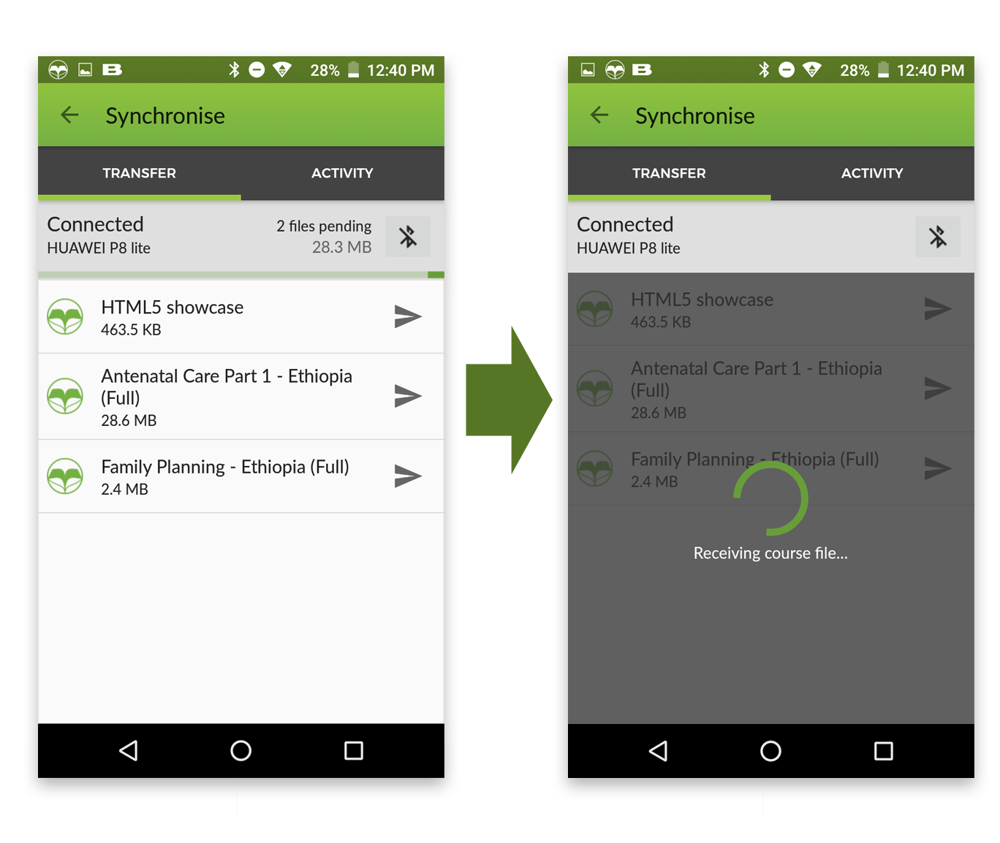

Using Bluetooth to transfer between devices
============================================
	
Bluetooth can be used to share course content and media files directly between
devices, so users without an internet connection can still get updates.

For this to be possible, when a course is installed or updated in the device, a backup copy
of the installation package is saved under the ``backup/`` folder of the app.

.. note::
	If you had the app installed prior to the update in which this functionality was added, the courses that were previously installed will not appear in the transfer section, as the backup files are not available.

General Workflow
--------------------------

#. Course content is updated or new courses are added, with new/updated media 
   files.
#. A supervisor or project staff member downloads the updated course/media 
   content onto their device, when they are in an area with internet 
   connection, or by sideloading the updated content.
#. When the supervisor visits their health workers in an area where no internet
   connectivity is available, they can synchronise the updated course/media 
   content from the supervisors device onto the health workers device, using 
   the bluetooth ``Sync`` option in the main OppiaMobile menu.
#. This will move all the selected content and media onto the health workers
   device.
#. The health worker could then also share these updates in the same way with 
   her colleagues.

The Sync transfer view
------------------------

To access the Bluetooth sharing functionality, select the "Sync" option from the main menu.
This will get you to the Synchronize view, where there are two different tabs: the "Transfer" tab to connect and
transfer course contents between devices, and the "Activity" tab, related to the student activity tracking and
how it gets synchronized in the server. We will focus in the first one, where you have the following components

* The status title shows the current state of the Bluetooth connection
* Under the status, you can see the information of the connected device
* A button to set your device in Discovery mode
* A button to connect to another device

Pairing Devices
-----------------

To start transferring courses between two devices using Bluetooth, we need to make the Bluetooth connection them first. For this, you
have to choose on of the devices to be the one that starts the connection.

If its the first time
those two devices are establishing a connection, we need to **pair them** first. The pairing process is only needed the first
time as a security measure to ensure that both devices recognize each other and grant the communication. The next time,
this process can be done automatically.

Bluetooth pairing is generally initiated manually by a device user. The Bluetooth pairing process is typically triggered automatically
the first time a device receives a connection request from a device
with which it is not yet paired. In order that Bluetooth pairing may occur, a password has will be exchanged between the two devices.
This password or "Passkey" as it is more correctly termed is a code shared by both Bluetooth devices, used to ensure that both users
have agreed to pair with each other.

Even if you have a Bluetooth-enabled accessory near a Bluetooth-enabled device,
they won’t be able to see each other until you put them into *discovery mode*. In this state, the device will be
“discoverable” by other devices for 5 minutes. Note that is not need to make a device discoverable if you’ll be connecting **from it**.
You only need to make a device discoverable if you’re connecting **to it**.

To make the device discoverable from within the app, press the "Discovery mode" button. A permission request dialog will appear,
asking you for permissions to make the device visible. Once you press this, you can start making the connection from the other device,
using the connect button in the status bar.

If both devices were previously paired, the device name should appear under the "Paired devices" list. If not, you can
press the `SCAN` button to start scanning for Bluetooth devices:

After selecting the device, since it is the first time they are making a connection, a dialog will appear in both screens
requesting you to allow the pairing process. Once this is granted in both devices, the connection will be made and the
the status bar will show the name of the device it is connected to.

Transferring courses
--------------------

Once the connection has been established, a list of the available courses will show up. Under each course title, you can
see the total transfer size for this course, that includes the course package and the related media files. Pressing the
send action to the right of a course will start the transfer process to the other device.

While a transfer is in progress, the number of files and the total size pending to transfer are shown in the status bar of the sender device.
The user can select more courses to transfer, that will get queued to transfer under the current pending files.
In the receiver side, the screen will show a loading message until the last transfer finishes.

After all the files are successfully transferred, the courses will be automatically installed in the receiver device