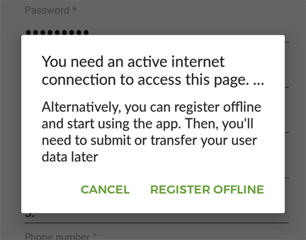

Offline Registration
=======================
	
If enabled in the Oppia app (a configuration setting when the app is compiled, see :ref:`general_settings`),
users will be able to register an account in the app even when no connection is available.

Basic Workflow
------------------

#. The user tries to register, but no internet connection is available at the moment.
#. The app prompts the user if he wants to be registered offline

#. If the user accepts, all his user data is saved locally and flagged as an offline user. He is then logged in, ready to start using the app as normal
#. Once a connection becomes available, the app will upload the user registration in the background with the related activity trackers.
#. Alternatively, the user activity can be exported into an activity log file (see :doc:`./activity_log` for more info in this topic), that in this case will include the registration data.
#. Once this activity log is tranferred to the server, the user will be created if it did not exist yet.

Activity log
------------

If the offline registered user is in an environment where there is no chances of having an internet connection, the option
to track the user activity is to export it into an activity log file. Since the user is not registered in the server yet, this
activity logs will include also all the information introduced in the registration form. The password is hashed using
a SHA-1 algorithm, so it is safe to be transferred.

Username collisions
---------------------

Currently, the system does not take into account the possible (although unlikely) scenario where two users are registered offline using the same username
and the data is exported and the updated to the server from an intermediate user that got the activity logs transferred.

So as of this moment, when activity data arrives at the server not posted by its original user (that includes ApiKey authentication), i.e.
activity that has been transferred from an offline device, the server implies that if there is already a registered user with the username
included in the activity log file, the activity trackers belong to that user.

A recommended approach is to set some criteria for the usernames to reduce the probability of collision, like using as
username a combination of the user last name and some unique identifier (e.g. health worker ID).
