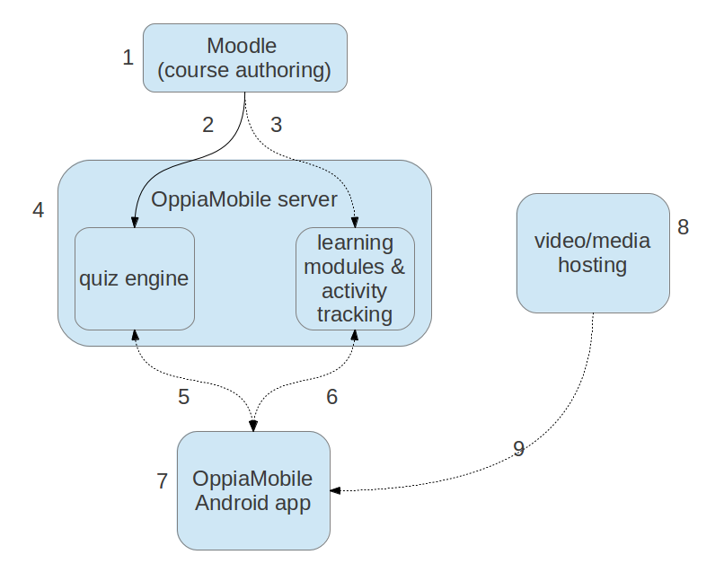

OppiaMobile Platform Architecture and Workflow
====================================================

#. Courses are authored in Moodle.
#. Courses are then exported to the OppiaMobile Server
#. The OppiaMobile server hosts all the courses, user accounts, media and 
   analytics data
#. When a user installs the app and creates an account, they can download 
   courses from the OppiaMobile server for running offline on their device
#. When the user accesses courses and completes activities (e.g. watching 
   videos,taking quizzes), this data is sent back to the OppiaMobile server 
   whenever there is an internet connection available.
#. Implementation owners, project managers etc can view the activity (e.g. 
   quiz results, time spent watching videos) for their users via the 
   OppiaMobile server dashboard. 

    

